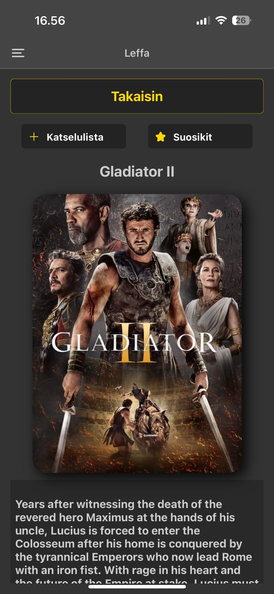

# Mobiiliprojekti

Sovelluksen ideana on pysyä kärryillä tulevien elokuvien julkaisuista kuten myös lukea arviointeja ja muuta.  
Käyttäjänä voi selata tulevien elokuvien julkaisuajankohtia, tarkastella niiden arvioiteja ja saada yleiskäsityksen mistä elokuva kertoo.

Käyttäjä voi myös lisätä omalle katselulistalleen elokuvia ja arvioida sekä selata elokuvia omien arvioiden perusteella, jotta henkilökohtaiset suosikit löytyvät helposti.

---

## Sovelluksen pääominaisuudet

### **Teattereihin tulevat elokuvat**

---

### **Parhaimmat arvioidut elokuvat**

Selaa elokuvia genren tai hakusanan perusteella.  

---

### **Tarjonnan selaus**

Selaa niin pitkään, kun tarjontaa riittää.  

---

### **Navigointi ja perusasetukset**

Käytä menuvalikkoa.  

---

### **Elokuvan yksityiskohdat**

Näe elokuvan tiedot, kuten kuvaus, arvosana, genret ja julkaisupäivämäärä.  

---

### **Arviointi ja suosikit**

Lisää suosikkeihin ja arvioi itse elokuvia.  

---

### **Omat suosikit**

Katso omat suosikkielokuvat.  

---

### **Katselulista**

Hallitse omaa katselulistaasi.  

---

### **Teatterit lähistöllä**

Näe oman sijaintisi lähellä olevat teatterit.  

---
